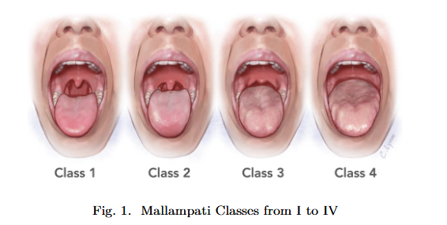
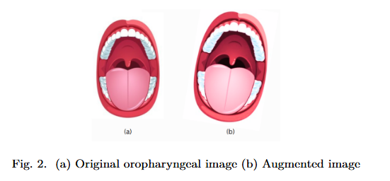
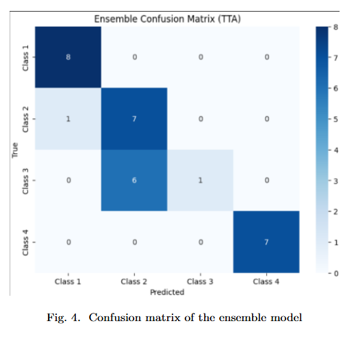
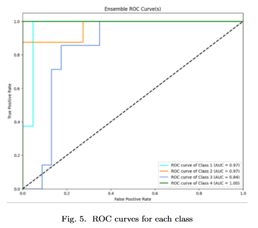

# Mallampati Classification Using Deep Neural Networks

An advanced deep learning-based approach for automating Mallampati classification — a critical preoperative test for assessing airway intubation difficulty.

## 🧠 Overview

This project presents a powerful ensemble model leveraging **MobileNetV2** and two **VGG16 variants** to classify oropharyngeal images into **Mallampati Classes I–IV**. The model addresses the subjectivity of manual screening, aiming to reduce human error and enhance patient safety.

Key techniques include:

- **Transfer Learning**
- **Data Augmentation**
- **Test-Time Augmentation (TTA)**
- **Ensemble Learning**
- **Class Weighting**

---

## 📋 Mallampati Classification System

| Class | Visibility Description                                           |
| ----- | ---------------------------------------------------------------- |
| I     | Full visibility of soft palate, fauces, uvula, tonsillar pillars |
| II    | Partial obstruction of tonsillar pillars                         |
| III   | Only soft palate and base of uvula visible                       |
| IV    | Only hard palate visible                                         |

 <!-- Replace with actual image -->

---

## 🔍 Related Work

This work builds on prior research in:

- Deep learning for airway and intubation assessment
- Automated medical image classification
- CNN ensemble models in clinical imaging
- Attention mechanisms in healthcare AI

---

## 📊 Dataset and Preprocessing

- **Images:** Clinical oropharyngeal images labeled Class I–IV
- **Imbalance Handling:** Class 2 limited to 60 images for training; validation/test are balanced.
- **Augmentations Used:**
  - Rotation ±10°
  - Width/height shift (5%)
  - Shear, zoom (5%)
  - Brightness (0.9–1.1)
  - Horizontal flip
- **Image Size:** Resized to 224×224 pixels
- **Batch Size:** 8

 <!-- Replace with actual image -->

---

## 🧰 Model Architecture

### 🔗 1. MobileNetV2

- Lightweight, efficient
- Fine-tuned last 10 layers
- Final head: GAP → Dense(128) → BN → Dropout(0.5) → Softmax

### 🔗 2. VGG16 - Model 1

- Fine-tuned last convolutional block
- Head: GAP → Dense(32) → BN → Dropout(0.5) → Softmax

### 🔗 3. VGG16 - Model 2

- Fine-tuned last 2 convolutional layers
- Head: Dense(24), stronger regularization (λ=0.03), Dropout(0.6)

---

## ⚙️ Training Protocol

- **K-Fold CV (k=3)** for model selection
- **Final retraining** on full dataset before ensembling
- **Loss:** Categorical crossentropy
- **Optimizer:** Adam
- **Callbacks:**
  - EarlyStopping
  - ReduceLROnPlateau
  - ModelCheckpoint

---

## 🧪 Ensemble Inference with Test-Time Augmentation

- Each model evaluated on 5 augmentations:
  - Rotation ±5°
  - Zoom/shift (3%)
  - Horizontal flip
- Final prediction = soft-voted average across models & augmentations

 <!-- Replace with actual image -->

---

## 📈 Evaluation Metrics

- **Accuracy, F1-score, Precision, Recall**
- **ROC AUC**
- **Precision-Recall Curve**
- **Confusion Matrix**

 <!-- Replace with actual image -->
 <!-- Replace with actual image -->
 <!-- Replace with actual image -->
 <!-- Replace with actual image -->

### 📋 Classification Report (Sample)

| Class   | Precision | Recall | F1-Score |
| ------- | --------- | ------ | -------- |
| Class 1 | 0.89      | 1.00   | 0.94     |
| Class 2 | 0.54      | 0.88   | 0.67     |
| Class 3 | 1.00      | 0.34   | 0.51     |
| Class 4 | 1.00      | 1.00   | 1.00     |

- **Macro Avg:** Precision 0.86 | Recall 0.75 | F1 0.71
- **Weighted Avg:** Precision 0.85 | Recall 0.77 | F1 0.72
- **Overall Accuracy:** 77%

### 📋 Per-Class Accuracy by Model

| Class   | Ensemble | MobileNetV2 | VGG16-1 | VGG16-2 |
| ------- | -------- | ----------- | ------- | ------- |
| Class 1 | 1.00     | 1.00        | 0.50    | 0.50    |
| Class 2 | 0.88     | 0.50        | 0.50    | 0.50    |
| Class 3 | 0.14     | 0.00        | 0.43    | 0.00    |
| Class 4 | 1.00     | 1.00        | 1.00    | 1.00    |

---

## 💬 Discussion

- **Strengths:**

  - Excellent performance on Classes 1, 2, and 4
  - Test-time augmentation improves prediction stability
  - Combines speed and depth of multiple architectures

- **Limitations:**

  - Class 3 predictions were weak
  - Dataset size was relatively small and lacked diversity

- **Solutions:**
  - Class weighting
  - Data augmentation
  - Test-time augmentation

---

## 🔮 Future Work

- Increase dataset diversity and size
- Apply cross-population validation
- Explore deeper networks and attention mechanisms
- Experiment with advanced optimization techniques

---
